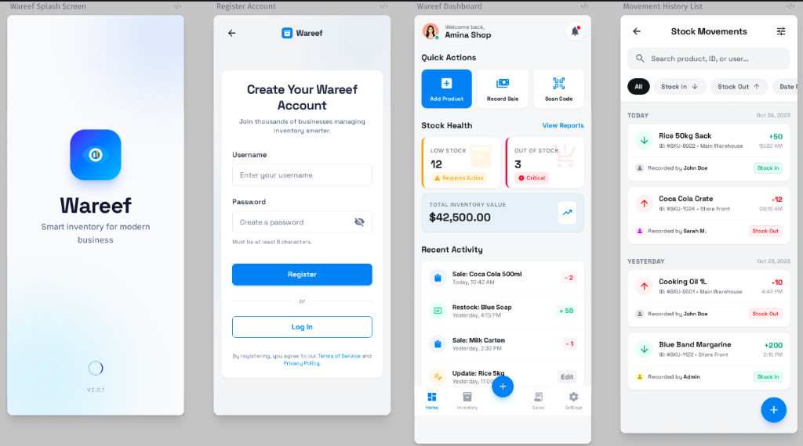

# Stock Management System

A comprehensive and modern stock management application built with Flutter. This project provides a robust solution for tracking inventory, managing products and categories, and monitoring stock movements in real-time.



## 🚀 Features

- **Advanced Dashboard**: Get a birds-eye view of your inventory with real-time metrics including total stock value, category distribution, and recent activity logs.
- **Dynamic Product Management**: Full CRUD operations for products, featuring image uploads, detailed specifications, and category assignment.
- **Intelligent Category Organization**: Organize your inventory into logical categories to streamline tracking and reporting.
- **Precision Stock Tracking**: Record stock-in and stock-out operations with ease. Every movement is logged with timestamps and details for full traceability.
- **Secure Authentication**: Robust user authentication system supporting both traditional email/password and social login options.
- **User Profile Management**: Personalized user experience with profile customization and secure account management.
- **Responsive & Modern UI**: A clean, intuitive interface designed for efficiency on both mobile and desktop platforms.

## 📱 Pages & Screens

1.  **Dashboard**: The central hub displaying key performance indicators and a summary of recent stock movements.
2.  **Products**: A comprehensive list of all items in stock with search, filter, and detail view capabilities.
3.  **Categories**: Manage the classification of your products with an easy-to-use interface.
4.  **Category Details**: Dive deeper into specific categories to see all associated products and metrics.
5.  **Stock Movements**: A detailed ledger of all inventory changes, helping you audit and reconcile stock levels.
6.  **Login & Registration**: Secure entry points for users to access and manage their inventory.
7.  **Profile**: Manage user credentials and application settings.

## 🛠️ Technology Stack

- **Frontend**: Flutter (Dart)
- **State Management**: Provider
- **Networking**: Dio / Http for REST API integration
- **Backend**: Node.js API (External)
- **Architecture**: Clean Architecture patterns for maintainability

## 🏁 Getting Started

To run this project locally:

1.  **Clone the repository**:
    ```bash
    git clone https://github.com/yourusername/stock_management.git
    ```
2.  **Install dependencies**:
    ```bash
    flutter pub get
    ```
3.  **Configure Environment**:
    Ensure your backend API is running and update the `ApiService` with the correct base URL.
4.  **Run the application**:
    ```bash
    flutter run
    ```
